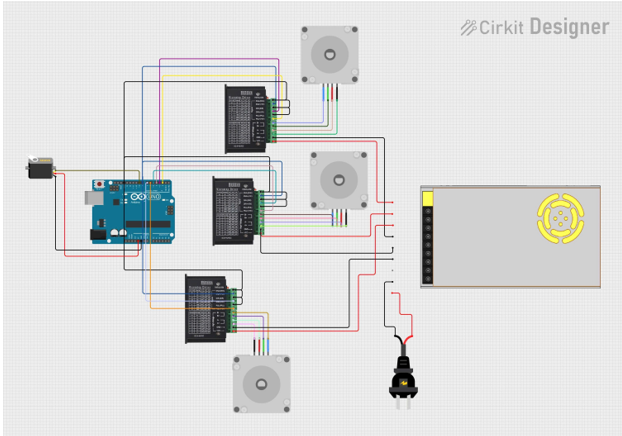

# SCARA 4-DOF Robot: Design, Simulation & Control

A full-cycle robotics project — from dynamic modeling and control design (MATLAB/Simulink), to mechanical design (SolidWorks), to a Python GUI driving a real Arduino-based prototype.

## Demo

- [Simulation & trajectory visualization](https://youtu.be/2t7z2ixyt3Y)
- [Real hardware motor control](https://youtu.be/OuQhNZBY79Q)

## Project Overview

This project covers the complete design cycle of a **4-DOF SCARA (Selective Compliance Assembly Robot Arm)**, made of 3 revolute joints and 1 prismatic (vertical) joint. The goal was to take the robot from a mathematical model all the way to a physical, motor-driven prototype:

- Derive the robot's dynamic equations of motion (mass and Coriolis matrices) from its physical parameters.
- Plan smooth joint trajectories between arbitrary start/end poses.
- Design a **computed-torque (PID) controller** and validate it in Simulink before deploying to hardware.
- Model and manufacture the mechanical structure in SolidWorks.
- Build a Python desktop application that visualizes the robot in 3D and can drive the physical arm over a serial link to Arduino.

## System Architecture

```
Trajectory Planning  →  Dynamic Control (PID)  →  Hardware (Arduino + motors)
   (MATLAB, cubic         (Simulink, mass matrix               ↓
    polynomial)            M(q) & Coriolis C(q,q̇))   Visualization (Python GUI)
```

1. **Trajectory Planning** (`matlab/traj_planning_4dof.m`) generates a smooth cubic-polynomial path for each of the 4 joints between a start and goal configuration.
2. **Dynamic Control** (`matlab/RobotScara.slx`) feeds the desired trajectory into a computed-torque control loop, using the robot's dynamic model (`matrixM.m`, `matrixC.m`) to compute the joint torques needed to track it.
3. **Hardware** — the resulting joint commands are sent over a USB-serial link to an Arduino, which drives the physical motors and reports back real joint positions.
4. **Visualization** — a Python/Tkinter GUI renders the robot in 3D in real time, using the same forward-kinematics engine whether it's driving a pure simulation or the live hardware.

## Hardware Wiring Diagram

<p align="center">
  
</p>

Arduino Uno as the central controller, driving 4× TB6600 stepper drivers (one per stepper joint) plus a servo for the gripper, powered by a 24V switching power supply.

## Repository Structure

```
├── matlab/
│   ├── Main_Scara4dof.m          # Robot physical parameters (mass, inertia, link length) + PID gains
│   ├── traj_planning_4dof.m      # Cubic-polynomial joint trajectory generator
│   ├── matrixM.m / matrixC.m     # Mass matrix M(q) and Coriolis matrix C(q, q̇)
│   ├── tinhMa.m / tinhb.m        # Computed-torque control terms
│   ├── RobotScara.slx            # Simulink model: dynamics + PID control loop
│   ├── RobotScara.xml / RobotScara_DataFile.m
│   └── Part*.STEP                # Link geometry (STEP)
├── solidworks/                   # Native SolidWorks CAD (5 parts + assembly)
├── scara_fk_trajectory(code ve quy dao).py       # Python GUI: FK + 3D trajectory simulation (no hardware needed)
├── scara_fk_arduino (code giao dien+ketnoiarduino).py  # Python GUI: same visualization + live serial link to Arduino
└── README.md
```

## Technical Highlights

**Trajectory planning** — each of the 4 joints follows a smooth 3rd-order polynomial (zero velocity at start/end):

```
q(t) = q0 + (3/T²)(qf - q0)·t² - (2/T³)(qf - q0)·t³
```

**Dynamic control (computed torque / PID)** — uses the robot's own dynamic model to linearize and decouple the system:

```
τ = M(q)·a + C(q, q̇)·q̇ + G(q)
```

**Hardware loop** — the Arduino script streams computed joint targets over serial, reads back real position data, and renders the live 3D pose in the same GUI used for pure simulation.

## Tech Stack

`MATLAB` · `Simulink` · `SolidWorks` · `Python (Tkinter, Matplotlib, NumPy, PySerial)` · `Arduino`

## Running the Simulator

```bash
pip install numpy matplotlib pyserial
python "scara_fk_trajectory(code ve quy dao).py"              # simulation only
python "scara_fk_arduino (code giao dien+ketnoiarduino).py"   # connects to Arduino
```

## Authors

Nguyễn Tiến Bảo · Nguyễn Việt Bách
